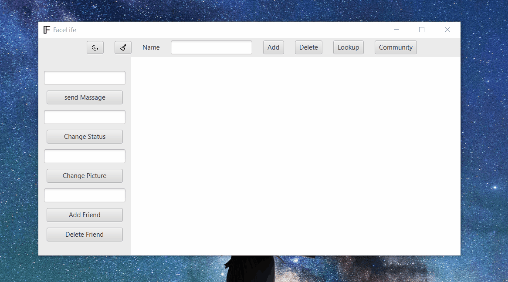

# FaceLite

FaceLite is javeFX application that aim to simulate a social media enviroment

## Demo

## Installation

you can try the application via this:
https://github.com/IcePhoenix7/FaceLite/tree/master/Download

## Buttons & Usage
- you have text field the you can add info through
- the button on the upper section are to make action with info in the tangent text field-  
  - Add: create a user with the name in the Textfield
  - Delete: remove the user with the name in the Textfield
  - Lookup: open the page of the user with the name in the Textfield
- Community: still under development it is supposed to open the all other users post and alow the user that is currently opened to post into commuinty 
- Darkmode: it has moon sign that change when you click it and change the layout of the program for the current user 
 
  - every user has it is state saved (i.e. dark or light mood)
- clear icon: it clears all textfields and add texting history 
- send message: send a message to the name in the upper text field if they are a fried
- change status: self explanatory
- Change picture: you put the name of the picture file
- Add a freind: put the name of the friend in it is textfield and add it so you can communicate with

## Tools

only JaveFX 
